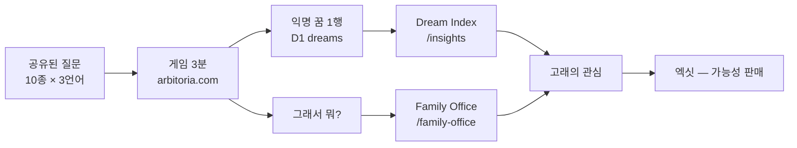
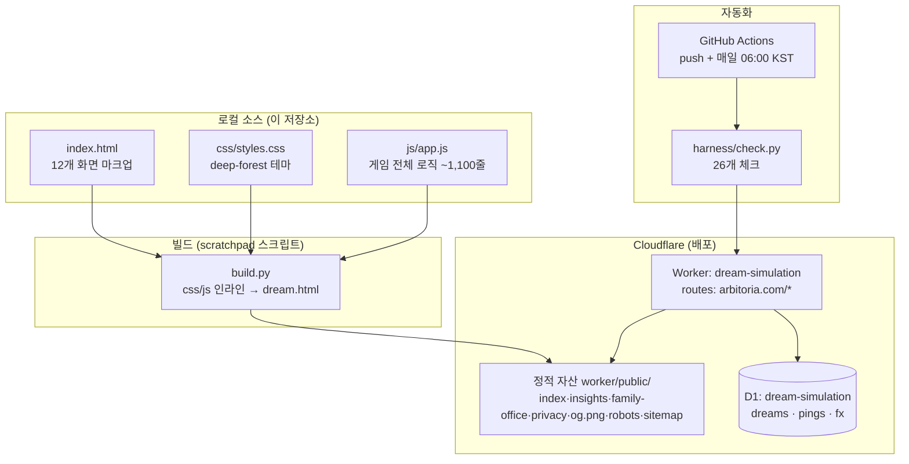
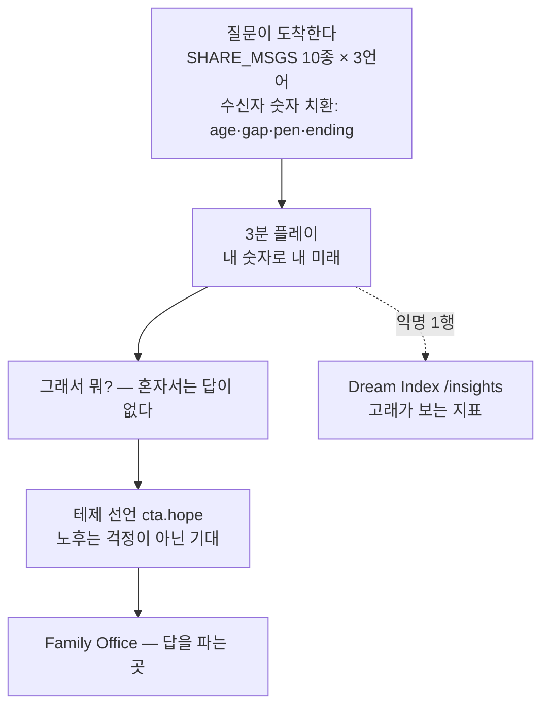

# 드림시뮬레이션 — 아키텍처

> 지금까지의 결과물이 **어떻게** 만들어져 있는지의 전체 지도.
> 이 문서는 협업용이다 — 곳곳의 `✏️ 여기부터` 블록에 자유롭게 생각을 적어 넣으면, 다음 세션에서 그걸 읽고 그림을 함께 키운다.
> 철학·엑싯 서사는 [ROADMAP.md](ROADMAP.md), 작업 규칙은 [CLAUDE.md](CLAUDE.md), 실패의 기록은 [POSTMORTEM.md](POSTMORTEM.md).

---

## 0. 한 장 요약



- **제품**: 무료 웹게임. 내 숫자로 30년 뒤를 그려보고, 복리와 4% 룰로 "꿈을 사지 말고 유지하는" 시점을 계산.
- **사업**: 게임은 데이터 수집기이자 깔때기 입구. 개인정보 0. 익명 꿈 데이터가 자산.
- **테제**: 노후는 걱정이 아닌 기대.

---

## 1. 시스템 구성 (인프라)



| 구성요소 | 역할 | 비고 |
|---|---|---|
| Cloudflare Worker | 모든 요청의 관문 — API 5개 + 정적 서빙 | `worker/src/index.js` |
| D1 (SQLite) | `dreams`(익명 21컬럼) · `pings`(시작/완주) · `fx`(월별 환율 캐시) | `worker/schema.sql` |
| GitHub Actions | 하네스 자동 실행 (push + cron `0 21 * * *` UTC) | `.github/workflows/harness.yml` |
| 로컬 미리보기 | no-cache 파이썬 서버, 포트 8777 | CLAUDE.md §3 |

**API 표면** (전부 익명):

| 엔드포인트 | 무엇 | 지키는 것 |
|---|---|---|
| `POST /api/dream` | 완주 시 꿈 1행 저장 | IP 미저장, 10분 동일필드 dedupe |
| `POST /api/ping` | 시작/완주 핑 (kind+lang만) | 완주율 계산용 |
| `GET /api/stats` | total · starts · completion_pct | 공개 |
| `GET /api/fx` | ECB 환율, 월 1회 갱신 캐시 | ko=만원·en=$·fr=€ 3통화 렌더 |
| `GET /api/insights` | 집계만 반환 (행 단위 절대 미반환) | Dream Index의 데이터원 |

---

## 2. 게임 흐름 (12개 화면)

```
0 언어(ko/en/fr) → 1 성별 → 2 나이 → 3 갈림길(지금 이대로 · 꿈의 직업 10 · 창업) → 4 나의 현실(수입·저축·자산…)
→ 5 진단 → 6·7·8 꿈 (각 화면 상단에서 [추천으로 고르기 = 10종 카탈로그] vs [내가 원하는 삶 = 직접 입력] 선택
   · 직접 입력: 차 가격 → 살고 싶은 곳+월세 → 여행 이름+빈도+회당 비용 · 지역·여행 이름은 로컬 전용, 서버·해시 미전송)
→ 9 계산(종자돈+투자 슬라이더+도달 시각화+🎲 도전 주사위) → 10 인생 이벤트(5개 선택지) → 11 세대 곡선(엔딩+공유)
```

### 갈림길 — 실패 가능성이 있는 게임 (화면 3 + 9)

- **경로 3종**: ① 지금 이대로(확률 없음) ② 꿈의 직업 — 직업별 성공 확률·준비 기간 보유 (의사 8%/10년 · 개발자 55%/2년 …) ③ 창업 — 목표 월수입을 내가 정하면 **확률이 야망에 반비례** (`50 − 14·log₂(목표/현재수입)`, 3~50%), 준비 기간은 비례.
- **도전 카드**: 성공 확률 미터 + 준비 기간 + 성공 시 저축 증가(늘어난 수입의 절반 가정).
- **주사위**: 계산 화면에서 "성공하면 {n}세 · 실패하면 {m}세" 두 가지를 보여준 뒤 🎲 굴림. 실제 확률로 성공/실패가 갈리고 그래프·엔딩에 반영. 실패해도 잃는 것 없음(현상 유지) — 리롤 가능("다른 인생으로 다시") = 리플레이 동기.
- 안 굴리고 지나가면 화면 10 진입 때 자동으로 굴려서 토스트로 알림.

- 화면 전환: `go(n)` → `renderScreen(n)`. 숨김은 전역 `[hidden]{display:none!important}`가 보증 (POSTMORTEM 교훈).
- 나이 화면에서 현실 터칭: "초고령 사회의 당신 세대에게 90세는 특별한 일이 아닙니다."
- 공유 링크는 `#d=` 해시(22필드 + v2 도전 4필드)로 전체 상태를 실어 나른다 → 받는 사람은 바로 9번 화면(그래프)에서 시작. 옛 22필드 링크도 그대로 열린다.
- 완주(`go(11)`) 시에만 `sendDream()` — 익명 1행 저장.

### 재무 엔진 (신뢰의 근간 — GAME_HANDOFF.md에서 검증된 채로 이식)

```
꿈의 한 달 dm  = 차 리스 m + 도시 월세 m + 여행(회당가 ÷ 주기)
종자돈 N      = dm × 12 ÷ (1 − 세율) ÷ 0.04      ← 4% 룰: 사지 말고 유지하라
도달 시간     = 월복리 fv 시뮬레이션 (수익률 5/7/10% 슬라이더)
세율          = kr 15.4% · us 15% · fr 30%
행복지수 h    = 기본 5 + 인생 이벤트 선택 효과 (0~10)
엔딩          = endingOf(도달월, 도달나이, h) → 7종 칭호
```

콘솔에서 `window.__validate()`로 원본 수치와 대조 가능 (예: `mortgage(256000,3.5,25)=1282`).

### 나무 은유 (모든 화면을 관통하는 언어)

종자돈 = 나무 · 4% 인출 = 열매 · 세대 = 숲. 숫자 설명이 어렵다는 피드백을 은유 하나로 풀었다.

---

## 3. 깔때기 아키텍처 (사업 관점)



- 공유는 **질문**을 보낸다. 마지막 화면에 미리보기 + 🎲 리롤 → 마음에 드는 질문을 골라 보냄.
- 문구 원칙 (ROADMAP §4): **모든 문구는 답이 아니라 질문. 답은 Family Office가 판다.**
- 완주율 = pings의 start 대비 done — 깔때기의 첫 병목 측정기.

---

## 4. 3언어 체계 (i18n)

- 단일 사전 `L = {ko, en, fr}` ~200키. **키 동등성은 하네스가 강제** — 한 언어에만 키를 추가하면 CI가 깨진다.
- 금액은 내부적으로 만원 단위 → 언어별 통화 렌더 (ko 억/만원 · en $ · fr €), 환율은 `/api/fx` 실시간(ECB 월간).
- 정적 페이지(insights·family-office·privacy)도 각자 사전 보유. 한국어 잔재 스캔이 하네스에 포함.

## 5. 컴플라이언스 (벨기에/EU — 엑싯 실사 방어선)

- **개인정보 0**: 이름·이메일·IP·쿠키ID 전부 미수집 → GDPR 전문 26조(익명정보) 적용 제외.
- 기능성 저장(언어 선택, 쿠키 안내 확인)만 localStorage → ePrivacy 5(3) 동의 예외.
- 추적 스크립트 0 (GA·Meta 픽셀 등 없음 — 하네스가 검사).
- `/privacy` 3언어, 감독기관 APD/GBA 명시.

## 6. 품질 게이트 (하네스)

`python harness/check.py` — 26체크: i18n 동등성 · 한국어 잔재 · EU 컴플라이언스 · 라이브 4페이지 · API 3종 sane · SEO(robots·sitemap·og·JSON-LD). push마다 + 매일 아침 자동. **"라이브가 지금 이 순간 멀쩡한가"를 사람 없이 확인하는 장치.**

## 7. 배포 파이프라인 (반복 작업의 표준 경로)

```
① 소스 편집 (index.html / css / js)
② build.py → dream.html (단일 파일)  +  build_artifact.py
③ Copy → worker/public/index.html
④ wrangler deploy  (전파 ~20–30초)
⑤ 라이브에서 computed style·보이는 텍스트로 검증  ← 내부 플래그 검증 금지
⑥ harness 26/26 → git commit & push (Actions가 한 번 더 검증)
```

---

## 8. 결정의 기록 (왜 이렇게 생겼나)

| 결정 | 이유 |
|---|---|
| 프레임워크 0, 바닐라 JS 단일 파일 | 캐시 사고 원천 차단 + 3분 게임에 빌드체인 불필요 |
| Worker 정적자산 + D1 | 서버 관리 0, 무료 티어, 도메인·API·데이터 한 곳 |
| 해시(#d=)에 전체 상태 | 서버에 상태 저장 없이 공유 가능 = 개인정보 0 원칙 유지 |
| 익명 dedupe (IP 없이 필드일치 10분) | 봇/중복 방어와 무추적 원칙의 타협점 |
| 환율 실시간 아닌 월 1회 | 게임의 시간 단위가 '연'이라 일 단위 정밀도 무의미 |
| 엔딩 7종 + 공유 문구 랜덤 | 리플레이 동기 + 같은 링크도 다른 질문으로 도착 |

## 9. 알려진 미완 (다음 그림 후보)

- [ ] **랜덤 이벤트 풀** — 인생 이벤트 10–15종 중 회차마다 다른 5종 (리플레이의 핵심, 완성도 90+의 마지막 조각)
- [ ] 실제 3D 렌더 이미지 (Higgsfield 크레딧 확보 시)
- [ ] contact@arbitoria.com (Cloudflare Email Routing이면 무료)
- [ ] 짧은 공유 링크 `/s/abc` (지금은 긴 해시 — 동작엔 문제 없음)
- [ ] 완주 100 → 첫 Dream Report 발행 (Phase 1 마일스톤)

---

## ✏️ 여기부터 — 협업 공간

> 아래는 비어 있는 게 정상. 생각나는 대로 적어두면 다음 세션에서 같이 그림으로 만든다.

### 내가 더 그리고 싶은 그림


### 지금 구조에서 마음에 안 드는 것


### 새 아이디어 (게임 / 깔때기 / 데이터 / 엑싯)


### 질문 (구조·비용·법·무엇이든)

